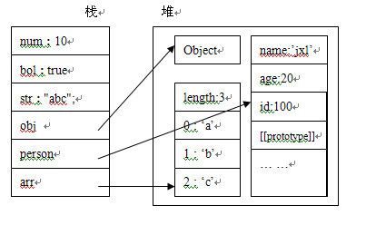

原始值和引用值
在ECMAScript中，变量可以存放两种类型的值，即原始值和引用值。
原始值指的就是代表原始数据类型（基本数据类型）的值，即Undefined,Null,Number,String,Boolean类型所表示的值。
引用值指的就是复合数据类型的值，即Object,Function,Array,以及自定义对象,等等
 
栈和堆
与原始值与引用值对应存在两种结构的内存即栈和堆
栈是一种后进先出的数据结构，在javascript中可以通过Array来模拟栈的行为

原始值是存储在栈中的简单数据，也就是说，他们的值直接存储在变量访问的位置。
 
堆是基于散列算法的数据结构，在javascript中，引用值是存放在堆中的。
引用值是存储在堆中的对象，也就是说，存储在变量处的值(即指向对象的变量，存储在栈中）是一个指针，指向存储在堆中的实际对象.
例：var obj = new Object(); obj存储在栈中它指向于new Object()这个对象，而new Object()是存放在堆中的。
 
那为什么引用值要放在堆中，而原始值要放在栈中，不都是在内存中吗，为什么不放在一起呢?那接下来，让我们来探索问题的答案！
 
首先，我们来看一下代码：
```
//简单类型都放在栈（stack）里
//对象类型都放在堆（heap）里
function Person(id,name,age){
    this.id = id;
    this.name = name;
    this.age = age;
}
var num = 10;
var bol = true;
var str = "abc";
var obj = new Object();
var arr = ['a','b','c'];
var person = new Person(100,"笨蛋的座右铭",25);
```
 然后我们来看一下内存分析图：
 理解js内存分配
 
变量num,bol,str为基本数据类型，它们的值，直接存放在栈中，obj,person,arr为复合数据类型，他们的引用变量存储在栈中，指向于存储在堆中的实际对象。
由上图可知，我们无法直接操纵堆中的数据，也就是说我们无法直接操纵对象，但我们可以通过栈中对对象的引用来操作对象，就像我们通过遥控机操作电视机一样，区别在于这个电视机本身并没有控制按钮。
 
现在让我们来回答为什么引用值要放在堆中，而原始值要放在栈中的问题：
记住一句话：能量是守衡的，无非是时间换空间，空间换时间的问题
堆比栈大，栈比堆的运算速度快,对象是一个复杂的结构，并且可以自由扩展，如：数组可以无限扩充，对象可以自由添加属性。将他们放在堆中是为了不影响栈的效率。而是通过引用的方式查找到堆中的实际对象再进行操作。相对于简单数据类型而言，简单数据类型就比较稳定，并且它只占据很小的内存。不将简单数据类型放在堆是因为通过引用到堆中查找实际对象是要花费时间的，而这个综合成本远大于直接从栈中取得实际值的成本。所以简单数据类型的值直接存放在栈中。