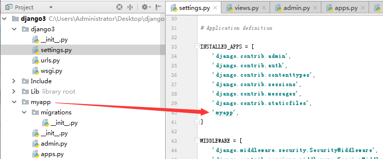
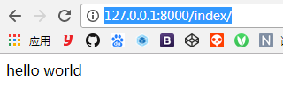

# 创建应用app  
> python3 django2   

在manage.py同级目录下  python manage.py startapp myapp

或者 pycharm tools -> run manage.py task

```
manage.py@django3 > startapp myapp
"C:\Program Files\JetBrains\PyCharm 2017.3\bin\runnerw.exe" C:\Users\Administrator\Desktop\django3\Scripts\python.exe "C:\Program Files\JetBrains\PyCharm 2017.3\helpers\pycharm\django_manage.py" startapp myapp C:/Users/Administrator/Desktop/django3

Following files were affected 
 C:\Users\Administrator\Desktop\django3\myapp\admin.py
C:\Users\Administrator\Desktop\django3\myapp\apps.py
C:\Users\Administrator\Desktop\django3\myapp\models.py
C:\Users\Administrator\Desktop\django3\myapp\tests.py
C:\Users\Administrator\Desktop\django3\myapp\views.py
C:\Users\Administrator\Desktop\django3\myapp\__init__.py
C:\Users\Administrator\Desktop\django3\myapp\migrations\__init__.py
```
> 注意：App名称不能与python默认的模块名冲突 比如 os   
# 并且添加应用名到 settings.py 里    
 

# 学习应用app目录的结构  
Migrations 数据移植模块 涉及数据库的操作  内容是自动生成的
admin.py 是当前app的后台管理系统的配置文件
apps.py 该app的一些配置  是在Django1.9以后自动生成的
models.py 数据模块  ORM框架  对象关系映射
tests.py  自动化测试模块  测试脚本
views.py  执行响应的代码所在的模块  整个项目最主要的代码编辑区

# 开始hello world
myapp -> views.py
```
from django.http import HttpResponse

def index(request):
    return HttpResponse('hello world')
```

django3 -> urls.py
```
from django.contrib import admin
from django.urls import path
from myapp.views import index #导入

urlpatterns = [
    path('admin/', admin.site.urls),
    path('index/', index), #匹配
]

```

# ok!   



线上seeting.py debug要改为false并加入host
```
DEBUG = False

ALLOWED_HOSTS = ['127.0.0.1']
```
# 独立出urls配置

一个工程下如果app很多 都写在根urls.py文件中 会 复杂而且很难维护
所以 另外一种 url的配置方法·
复制一份urls配置到app项目下，修改为
```
from django.urls import path
from . import views  # +

urlpatterns = [
    path('index/', views.index),  # +
]

```
然后根目录配置修改为
```
from django.contrib import admin
from django.urls import path, include # +

urlpatterns = [
    path('admin/', admin.site.urls),
    path('myapp/', include('myapp.urls')), # +
]
```
然后访问路径为 http://127.0.0.1:8000/myapp/index/

# django使用template模板

项目下新建templates文件夹，templates下新建项目同名文件夹 如：myapp/templates/myapp/index.html

index.html
```
<!DOCTYPE html>
<html lang="en">
<head>
    <meta charset="UTF-8">
    <title>Title</title>
</head>
<body>
你好，世界！
我是{{ name }}
</body>
</html>
```
myapp/views.py
```
from django.shortcuts import render

def index(request):
    return render(request, 'myapp/index.html', {'name': 'artiely', 'age': '20'})
```
render()  一般有三个参数：request 模板名 返回给前端的数据

DTL的使用：
render()函数支持一个dict类型参数
该字典是后台传递到前端模板的参数，键为参数名
在前端模板中使用{{参数名}}来直接使用

DTL 也支持if else  for循环这样的逻辑操作     {{ }}

> 细节：Django查找Template是按照INSTALLED_APPS中添加的顺序查找的
如果在两个app中使用了同名的html文件 那么就会有问题
解决方案：1、改名  2、在app的templates目录下再创建一个与app同名的目录
然后将html文件放到该目录下即可

# _ORM之创建models与数据库表

Render的第三个参数 返回给前端的数据  是从数据库中获取的
Models 模型   对应数据库的一张数据表   以类的形式表现
ORM 对象关系映射：所有对数据库的操作实际上是对类以及对类的对象的操作
隐藏了数据访问的细节，不需要写任何sql语句    实现了对象与数据库之间的映射

步骤：
1、在应用根目录的models.py 引入models模块
2、创建类 继承models.Model 该类就是一张数据表
3、在类中创建字段   
models.py
```
from django.db import models

# Create your models here.
class Article (models.Model):
    title = models.CharField(max_length=32, default='无标题')
    content = models.TextField(default='暂无内容')
```

字段创建：
字段即类里面的属性
attr = models.CharField(max_length=64)

字段类型看文档：https://docs.djangoproject.com/en/1.11/ref/models/fields/

将模型映射成数据表：
1、python manage.py makemigrations app名
2、python manage.py migrate

Django会在app/migrations/目录下生成移植文件(django2好像没有)
执行python manage.py sqlmigrate 应用名 文件id 可以查看sql语句

生成的数据库在哪里？  使用了默认的sqlite3

查看并编辑db.sqlite3  使用第三方 轻量级 完全免费  
Windows：sqlite expert personal
Mac：SQLiteStudio （推荐）

页面数据获取：
在views.py中import models
Article = models.Article.objects.get(pk=1)   select 主键为1
render(request,page,  {‘article’: article})
也支持对象的传递  
views.py
```
from . import models
from django.http import HttpResponse

def index(request):
    article = models.Article.objects.get(pk=1)
    return render(request, 'myapp/index.html', {'article':article})
```

# django admin
django自带的功能强大的后台数据管理系统

http://127.0.0.1:8000/admin/
Python manage.py createsuperuser 创建一个超级用户
or 创建用户 tools run manage.py task
```
createsuperuser
# 用户名
# 邮箱
# 密码
```
然后登陆

改语言  修改settings.py  的LANGUAGE_CODE=‘zh_Hans’   zh_Hant

setting.py
```
# LANGUAGE_CODE = 'en-us'
LANGUAGE_CODE = 'zh-hans'
```
把自己的应用加入到后台管理  

配置应用：(把应用注册到后台管理模块中)
在应用下的admin.py中引入自身的models模块
同时添加注册：admin.site.register(models.Article)

myapp/admin.py
```
# Register your models here.
from . import models

admin.site.register(models.Article)
```
这样admin后台就会多一个admin站点管理

修改`article object`的显示
修改数据默认显示的名称：
在models.py中的Article类下添加一个方法
如果是python3   则__str__(self)
如果是Python2  则__unicode_(self)
Return self.title  or self.content

models.py
```
class Article (models.Model):
    title = models.CharField(max_length=32, default='无标题')
    content = models.TextField(default='暂无内容')

    def __str__(self):
        return self.title

```
# 文章详情

 article_id组名必须与views.py里的响应函数里的参数名保持一致
正则表达式：
(?P<article_id>[0-9]+)

+  匹配1次或者多次前面出现的正则表达式
[0-9]  \d  都是匹配数字
(?P<name>…)     向一个仅由name标识而不是数字id标识的正则分组匹配   
py3的url的规则https://docs.djangoproject.com/en/2.0/topics/http/urls/
urls.py
```
urlpatterns = [
    path('index/', views.index),
    path('article/<int:article_id>', views.article),
]
```
views.py
```
def article(request, article_id):
    article = models.Article.objects.get(pk=article_id)
    return render(request, 'myapp/article.html', {'article': article})
```

# 编辑
编辑表单的响应函数 action post
使用request.POST[‘参数名’]获取表单数据
创建对象：
models.Article.objects.create(title,content)

CSRF验证失败. 请求被中断.     安全性的问题  Django的安全性是比较高的  



跨站请求伪造   网站攻击

> 还有命名空间 django2 incloud加了命名空间就必须给项目加`app_name`

# Templates过滤器：写在模板中，属于DTL
可以修改模板中的变量 从而显示不同的内容
怎么使用过滤器？    {{value|filter}}  例子：{{ list_nums | length}}
过滤器可以叠加的    {{ value | filter1 | filter2 | filter3 | …}}

Django模板的特性：如果没有这个值 则为空值  空字符串 不会报错
<input type="hidden"
value="{{ article.id | default:'0' }}"
更多的Django内建过滤器  有官方文档

# Django Shell：
它是一个Python的交互式命令行程序
自动引入了我们的项目环境
我们可以使用它与我们的项目进行交互
启动Django Shell：python manage.py shell
通过代码的方式跟项目进行交互：
from blog.models import Article
Article.objects.all()
作用：1、调试 2、测试未知的方法或返回的格式
Article.objects.all().values()

# Admin增强型：
后台密码 忘记？
后台增加一些栏目：
1、修改admin.py的后台注册模式  admin.site.register
创建admin的配置类：class ArticleAdmin(admin.ModelAdmin)
注册：admin.site.register(Article, ArticleAdmin)
2、显示其他字段 在配置类中加上属性
list_display = (’title’, ‘content’)
list_display同时支持元组和列表  必须是字符串而且与models中类的属性一致

Admin过滤器：
pub_time = models.DateTimeField(auto_now=True)
pub_time = models.DateTimeField(null=True)


list_filter = ('pub_time,)

