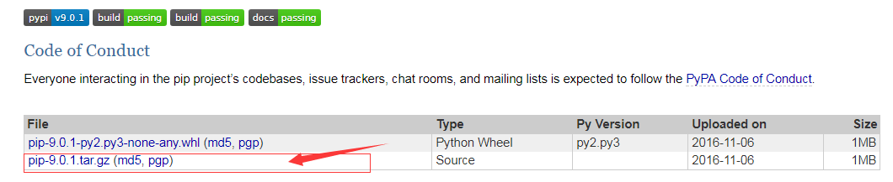
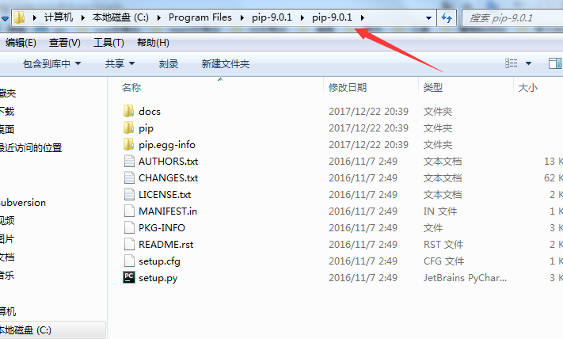
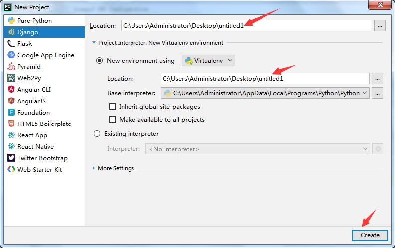

# pip 安装
https://pypi.python.org/pypi/pip#downloads

选择下载版本  
 

下载后放到一个文件夹下 解压 


执行命令安装
```
python steup.py install
```

查看
```
pip --version
```

# django 安装

https://www.djangoproject.com/download/

```
pip install Django==2.0
```
1 pip安装
2 源码安装 下载tar包 里面有源码   然后在目录里执行 python setup.py install  

验证django安装是否成功：
1、python -m django —version
2、python       import django没有报错


对django支持最好的ide工具：编辑器 是Pycharm
还有 Sublime Text    Atom

安装成功可以执行`django-admin` 查看django的相关命令      
可以通过 命令新建项目
```
django-admin startproject my-progect
```

还可通过pycharm新建django项目
  
loction的文件名要一直(pychram版本不同可能有差异)
# 项目结构
Manage.py 与项目进行交互的命令行工具集的入口   项目管理器

执行 python manage.py来查看所有的命令
```
Python manage.py runserver    127.0.0.1:8000
Python manage.py runserver 8888   修改启动端口  127.0.0.1:8888
```
```
Run 'python manage.py migrate' to apply them.
December 22, 2017 - 21:56:46
Django version 2.0, using settings 'django3.settings'
Starting development server at http://127.0.0.1:8000/
Quit the server with CTRL-BREAK.

```
看到上面的提示就启动成功了

pycharm 快速启动 tools-> run manage.py task 

Sqlite3会自动生成的

与项目名称同名的文件夹：是项目容器  目录名称不建议修改
wsgi.py   web server gateway interface
Python应用与web服务器之间的接口

Urls.py  配置url
Django项目中所有地址（页面）都需要我们去配置其url

settings.py
项目的最核心配置文件

__init__.py 空的  声明模块的文件  变成一个模块 可以在代码中引用
内容默认为空，如果丢失可以直接复制其他的过来


