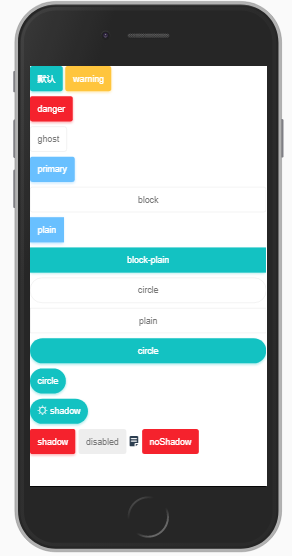

# 需求
- 自定义button文本
- button左边icon 右边icon
- button disable
- 背景带进度
- 加载loading
- 点击特效
- 尺寸 大中小
- block 长短型
- 不同色彩
- 不同形状
- 自定义样式
- 按钮组
- 文字超出隐藏
- 1px
- 点击回馈


# 样式

1.绝对的采用预编译语言 此处我采用less

2 单独声明样式变量 提高可维护性

```
// 背景色
@primary:#69c0ff;
@warning:#ffc53d;
@danger:#f5222d;
@base:#13c2c2;
@ghost:#fff;
@body-bg:#f0f0f0;

// 圆角
@border-radius:4px;
// 边框
@border-color:#d9d9d9;

// 字体颜色
@color-white:#fff;
@color-light:#999;
@color-dark:#777;
```
3. 混合样式的示例(部分代码)
```

@import '../style/var.less';
.mix-hover(@arg-color){
  &:hover{
    background:lighten(@arg-color,10%)
  }
  &:active{
    background:darken(@arg-color,10%)
  }
}
.i__button{
  background: @primary;
  text-align: center;
  color:contrast(@primary,@color-white);
  border-radius:@border-radius;
 .mix-hover(@primary)
}

```
# button.vue

1. 主要根据属性控制样式

```
<template>
  <button class="i__button i__ripple" :class="['i__button--' + type, 'i-button--' + size, {
          'is-disabled': disabled,
          'i-border-radius':type=='ghost',
          'is-plain': plain,
          'is-circle':circle,
          'i__button--block':block,
          'no-shadow':noShadow
        }]" 
        @click="handleClick"
        :disabled="disabled"
        >
    <span >
      <slot name="icon">
        <i-icon v-if="icon"></i-icon>
      </slot>
    </span>
    <slot></slot>
  </button>
</template>

<script>
  import ICon from '../icon'
  export default {
    // 这是该组件的自定义名称，
    // 之后引用组件时就会用到这个名称。
    name: 'i-button',
    components: {
      ICon
    },
    methods: {
      handleClick(evt) {
        this.$emit('click', evt);
      }
    },
    props: {
      icon: String,
      disabled: Boolean,
      plain: Boolean,
      ghost: Boolean,
      block: Boolean,
      circle: Boolean,
      noShadow: Boolean,
      type: {
        type: String,
        default: 'base',
        validator(value) {
          return [
            'base',
            'warning',
            'ghost',
            'danger',
            'primary'
          ].indexOf(value) > -1;
        }
      },
      size: {
        type: String,
        default: 'normal',
        validator(value) {
          return [
            'small',
            'normal',
            'large'
          ].indexOf(value) > -1;
        }
      }
    }
  }
</script>
```
示例效果  


> 还有些未完成的效果
